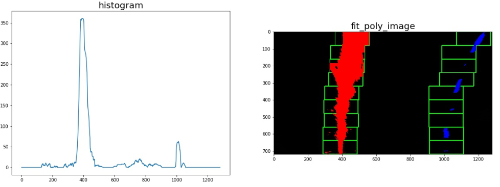

# Writeup Project2 Advanced Lane Finding

The purpose of this project is to makeup pipeline code to get lane from images.
This project consists of the following files.

* README.md 
    * This file. It explain about how to process images and submission files.
* adv_lane_find.ipynb
    * This file is described with how to get parameters of Camera calibration, Persprctive transform, and the pipeline implementation and results confirmation are done.
* adv_lane_find_pipeline.py
    * This file is described with functions that make up the pipeline. This file is imported in adv_lane_find.ipynb.
* ./submission_images/*
    * This directory has files that images outputted by Camera calibration, Perspective transform, and Pipeline. Those files are uesd in this writeup file.
* ./submission_videos/*
    * This directory has files which are video outputted by Pipeline.
* ./input_videos/*
    * This directory has input videos.

## To get a parameter of camera calibration
---
All camera have a distortion caused by factors such as lens. 
In order to obtain a curvature of a curve from an image obtained by the camera and obtain a position of the car in the lane, it is necessary to correct the distortion.

The code to get an parameter of correction of the distortion is described in "Get parameter for Camera Calibration" section of "adv_lane_find.ipynb".

In this project, the calibration parameters were obtained using the chess board images with square grid are known and cv2.calibrateCamera.
The chess board images must have grid points that are arranged parallel and vertically.
However, depending on the angle between the camera and the chess board and the distortion of the camera, it changes in the image.
The API "cv2.calibrateCamera" can obtain parameters with higher precision by inputting a plurality of chess board images.

In this project, those Camera Calibraion parameters are obtained as "mtx" and "dst", which are used as input of pipeline.

The processing images of calibration is below. Colorful lines connects detected grid points. 

## To get a parameter of Perspective transform
---

An image acquired by a camera attached to a car has a viewpoint close to horizontal. However, when calculating the curvature of the curve, it is appropriate to look down at the road from a viewpoint close to vertical.

In this project, the code is described in "Get parameter for Perspective transform" section of "adv_lane_find.ipynb" which get the parameter to convert a image from horizontal to vertical view.

In the code, from images that are considered to be in straight line traveling, four points connecting the left and right lanes with a rectangle were obtained.
Then it was specified the point at which each point is projected in an image vertical view point.

The API "cv2.getPerspectiveTransform" can calculate transform paramter with those points, and the parameter is obatained as "M".
And the inverse transform paramter can be obtained with those same points by the API "cv2.getPerspectiveTransform". The inverse paramter is obtaines as "Minv".

The processing image is below.
The left image is horizonal image and the right image is transformed vertical image.
In the left image, the top of red trapezoidal line are designated points, and those points are projected the top of red rectangular line in the right image.

## Pipeline
---

The pipeline code is described in "Pipeline" section of "adv_lane_find.ipynb" as function named "FindLane".
In the pipeline, the processing is carried out in the following steps

* get undistort image
* get binary image which indicate elements considered to be lanes
* get bird view image
* get lane 
* get position of the car in the detected lane
* get the radius of cuvature of the detected curve
* get draw image which is the lane area is painted on original image. 

These steps are described as functions in "adv_lane_find_pipeline.py", so they are explained below.

## get_undistorted
---
In this function, input image is undistorted using previously obtained parameters("dst" and "mtx").
The way to obtain these parameters has already been explained in this sentence.

The proccesing result is bleow. The left image is original image and the right image is undistorted image.

## get_binary
---
In this function, the input image is transformed to binary image.
The pixels which are considered as lane are True(value is 255), else are False(value is 0).

Two approaches are implemanted to get pixels respectively, and the pixel judged as True by either one was set to True. 
That is, OR judgment was carried out.

The first approach uses the gradient of the brightness in the X direction.
Normally, the lane extends in the vertical direction (Y direction) of the camera, so we can get a lane from the edge obtained from the gradient of the brightness in the horizontal direction (X direction).
The API "cv2.Sobel" is used for calculating the gradient.

HoweveHowever, it can not cope with the case where the lane is yellow only with the inclination of brightness, and when the asphalt color is bright.
So the second approach is implemented.

The second step calculate the Saturation of the pixels.
By this approach, detection can be performed strongly, especially when the lane is yellow.

The proccesing result is bleow.
White pixels were judged to be true, that is, it was judged that there was a possibility of being a lane pixel.

## get_bird_view
---
In this function, input image is transformed to bird view (vertival view point image) using previously obtained parameters("M").
The way to obtain these parameters has already been explained in this sentence.

The proccesing result is bleow. 

## fit_polynomial
---
This function get the polyfit curve with left and right lane from binary birds view.

However, since it can not be approximated from all the candidate pixels, a candidate pixel considered to be a lane is selected and an approximate curve is obtained therefrom.

If it do not have previous knowledge, use function "find_lane_pixels_with_windows" coded in "adv_lane_find_pipeline.py".

Firstly, This function calculate the total number of candidate pixels in the Y axis direction for each column of X.
Then, it determines the largest sum of the left half X as the left lane candidate column and determines the largest total of the right half as the right lane candidate column.

Then, the row direction is divided into several parts, a window centered on the candidate row is created for the row closest to the car, and candidate pixels in the window are determined as pixels of the lane. After that, similarly, candidate columns are determined from the candidate pixels in the row window, the lane pixels of the next row are detected, and this is repeated to extract pixels of the lane.
Then, an approximate curve is obtained using the obtained lane pixel by the API "np.polyfit".

By doing like this, it is possible to exclude white falling objects or the like located away from the lane from the original data approximating.

The proccesing result is bleow. 
The left image is histogram of the total number of candidate pixels in the Y axis direction.
The left peak must be considered as left lane candidate column, and the right peak is for the right lane.
The green boxes in the right image are row windows, and red pixels are left lane candidate pixels and blue pixels are right lane candidate pixels.

Once the approximate curve is obtained, it is not necessary to recalculate the window in the next frame, and the row window created based on the previous approximate curve can be used.
This function is coded as "find_lane_pixels_with_previous_polyfit" in "adv_lane_find_pipeline.py".

## get_horizontal_gap_from_lane

In this function, we calculate a distance of deviation from the lane center which tha car exist.

In order to calculate the distance, we use the approximate curve of the lane already obtained.
The difference between the value of the column (X) of pixels in the center of the left and right lanes and the center of X of the image is the distance you want to calculate.
Then, since it is known that the lane width is 3.7 m, we convert the distance from pixel unit to meter unit by using the ratio with the pixel of the width of the approximate curve of the lane.

## measure_curvature_real

In this function, we calculate the radius of curvature of the left and right lanes.
It can be calculated using approximate curve expressions, and results are obtained using pixel to meter transform coefficients.

## draw

In this function, we draw the area of the lane on the image, and the image is transformed the image back to the original horizontal viewpoint.

The API "cv2.fillPoly" and approximation curve of left and right lanes are used to draw the green area.
Then, we convert the viewpoint using the API "cv2.warpPerspective" and previously obtained coefficient "Minv".

The result image is below. 

## Result video of pipeline
---
The result of processing input movie "./input_videos/project_video.mp4" using the created pipeline is "./output_videos/output_project_video.mp4".

## Discussion
---
This pipeline has a major weakness. It is mainly a problem of "get_binary" function by judging the groove and shadow of the road as candidate pixels of the lane.
This will not work well for more difficult videos.
It is thought that it is necessary to further devise such as excluding dark pixels, in addition to simply using a pixel with a large gradient of brightness as a candidate pixel.